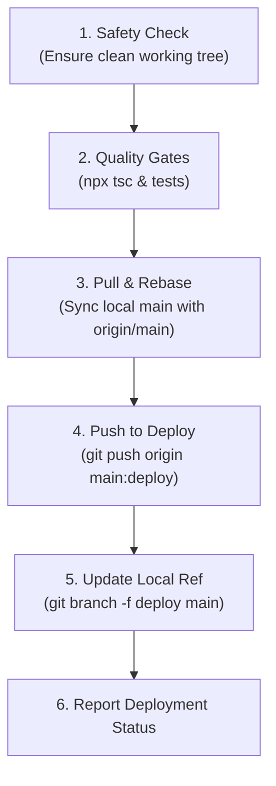

# Deploy Site (`/deploy-site`)

Deploy the latest verified code from branch `main` to the production `deploy` branch.

---

## Workflow Overview



---

## Quick Usage

Run the automated helper script:

```bash
# Standard deployment (runs typechecks, tests, and pushes main to deploy)
.agents/skills/deploy-site/scripts/deploy.sh

# Dry-run mode (validates working tree and runs tests without pushing)
.agents/skills/deploy-site/scripts/deploy.sh --dry-run

# Emergency skip tests (if tests were already verified)
.agents/skills/deploy-site/scripts/deploy.sh --skip-tests
```

---

## Step-by-Step Manual Procedure

If running individual commands manually:

1. **Verify working tree is clean:**
   ```bash
   git status
   ```
   Ensure there are no uncommitted changes. If dirty, commit or stash them first.

2. **Run quality gates:**
   ```bash
   npx tsc --noEmit
   npx tsx --test src/lib/*.test.ts
   ```

3. **Ensure local `main` is up to date:**
   ```bash
   git fetch origin main
   git pull --rebase origin main
   ```

4. **Sync commits to `deploy` branch on remote:**
   ```bash
   git push origin main:deploy
   ```

5. **Update local `deploy` branch pointer for consistency:**
   ```bash
   git branch -f deploy main
   ```

6. **Confirm deployed commit:**
   ```bash
   git log -1 --oneline origin/deploy
   ```
