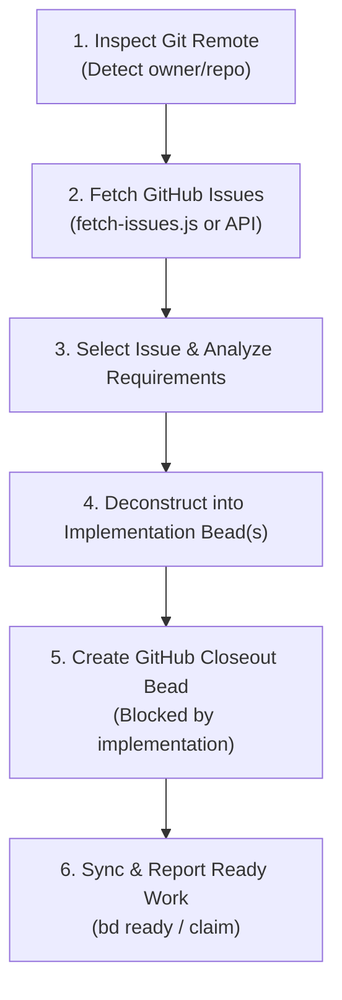

# GitHub to Beads (`/github-to-beads`)

Import open GitHub issues from the current repository and convert them into durable, tracked **Beads** (`bd`) tasks — complete with dependency edges and an automated **closeout task** that marks the GitHub issue resolved upon completion.

---

## Workflow Overview



---

## Step 1: Detect Repository Remote

Run:
```bash
git remote get-url origin 2>/dev/null || git config --get remote.origin.url
```
Extract `{owner}` and `{repo}` (supports both HTTPS and SSH URLs).

---

## Step 2: Fetch Issues

Use the bundled helper script:

```bash
# List all open issues
node .agents/skills/github-to-beads/scripts/fetch-issues.js

# Fetch a specific issue by number (e.g. #2)
node .agents/skills/github-to-beads/scripts/fetch-issues.js 2

# Raw JSON output for programmatic inspection
node .agents/skills/github-to-beads/scripts/fetch-issues.js --json
```

*Fallback without script:*
```bash
curl -s -H "Accept: application/vnd.github.v3+json" "https://api.github.com/repos/{owner}/{repo}/issues?state=open"
```

If `gh` CLI is installed and authenticated:
```bash
gh issue list --state open
gh issue view <issue-number>
```

---

## Step 3: Present and Confirm Scope

1. If the user specified an issue number (e.g. `/github-to-beads 2`), target that issue immediately.
2. If multiple issues exist and none was specified, present the open issues list with title, author, and preview, and confirm with the user which issue to convert.
3. Review the issue body, comments, and any linked mockups or code references.

---

## Step 4: Deconstruct into Implementation Beads

Break the issue into concrete, vertical slice tasks following Beads conventions:

* Slices should be verifiably testable (TDD approach).
* Use non-interactive CLI commands (`bd create`).
* Title format: `GitHub #<id>: <Task Name>`
* Reference the source issue URL in the description: `From https://github.com/{owner}/{repo}/issues/{id}`.

### Example Single-Task Issue:
```bash
bd create "GitHub #2: Replace Carto tile layer with keyless OpenStreetMap / Voyager" \
  --description="From https://github.com/{owner}/{repo}/issues/2
- Update MapView tileLayer to use valid keyless provider or add configured tile key.
- Verify map loads without HTTP 401/403 errors.
- Run unit tests and type checks." \
  --type=feature \
  --priority=1
```

### Example Multi-Task Issue (Decomposed into Slices):
When an issue spans multiple layers (e.g., Schema + API + UI), create sequential or parallel bead tasks:
1. `bd create "GitHub #X: Schema and API endpoints" --type=task --priority=1`
2. `bd create "GitHub #X: Frontend UI and interaction" --type=task --priority=1`

---

## Step 5: Create the GitHub Closeout Bead (Mandatory)

Always create a dedicated closing task to ensure the GitHub issue is resolved and closed cleanly once implementation and verification are complete.

The closeout task **must be blocked by** the implementation task(s).

```bash
bd create "Close GitHub #<id>: <Issue Title>" \
  --description="Mark GitHub #<id> as resolved upon completion:
1. Verify all implementation and test beads are passing (npx tsc --noEmit, test suite, build).
2. Commit with Git resolution keyword: git commit -m '... (Fixes #<id>)' or (Closes #<id>).
3. Push to remote: git push origin main.
4. If gh CLI is available: gh issue close <id> --comment 'Resolved in commit <hash>'.
5. Verify GitHub issue is marked closed on GitHub.
6. Synchronize Beads: bd dolt push." \
  --type=task \
  --priority=1
```

Then link the blocking dependency:
```bash
# Set closeout bead to be blocked by the implementation bead(s)
bd dep add <closeout-bead-id> <implementation-bead-id>
```

---

## Step 6: Session & Execution Rules

1. **Non-interactive execution**: Always pass command-line arguments to `bd create` and `bd update`. Never run `bd edit` which prompts an interactive editor.
2. **Atomic claims**: When beginning work on a bead, claim it atomically:
   ```bash
   bd update <bead-id> --claim
   ```
3. **Closing beads**: When an implementation task is complete:
   ```bash
   bd close <bead-id> --reason="Implemented and verified with unit tests"
   ```
4. **Closing the GitHub issue**:
   - The final closeout bead verifies git push with `Fixes #<id>` or executes `gh issue close <id>`, verifies issue closure on GitHub, closes its own bead, and runs `bd dolt push`.

---

## Quick Reference Commands

| Action | Command |
| :--- | :--- |
| **Fetch issues** | `node .agents/skills/github-to-beads/scripts/fetch-issues.js` |
| **Inspect issue** | `node .agents/skills/github-to-beads/scripts/fetch-issues.js <id>` |
| **Create implementation bead** | `bd create "GitHub #<id>: <Title>" --description="..." --type=feature --priority=1` |
| **Create closeout bead** | `bd create "Close GitHub #<id>: <Title>" --description="..." --type=task --priority=1` |
| **Link blocker** | `bd dep add <closeout-id> <impl-id>` |
| **Inspect ready work** | `bd ready` |
| **Sync beads remote** | `bd dolt push` |
