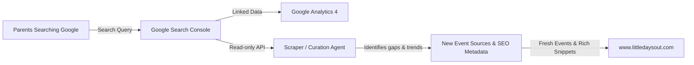

# Google Analytics 4 (GA4) Architecture & SEO Integration Guide

This guide answers architectural and operational questions regarding GA4 data streams, mobile platform tracking, and connecting analytics/Search Console data to agents for organic SEO optimization.

---

## 1. Quick Answers

### Q: Should I create separate data streams for iOS and Android in GA4?
> [!IMPORTANT]
> **No, not at this time.** 
> Little Days Out is currently a responsive Web Application / Progressive Web App (PWA). In GA4, iOS and Android data streams are strictly engineered for **native app binaries** compiled with the Google Analytics for Firebase SDK (`firebase-core`).
>
> When mobile users visit `https://www.littledaysout.com` on Safari (iOS) or Chrome (Android) — or install it to their home screen as a PWA — their sessions are automatically tracked via the **Web Data Stream** (`G-P4ZPYFWRLK`). GA4 already breaks down visitors by device category (`mobile`, `tablet`, `desktop`) and operating system (`iOS`, `Android`, `macOS`, `Windows`).
>
> Creating iOS/Android streams without native binaries will leave you with dormant, empty streams that never receive data.

### Q: Should I connect the agent to analytics and search console for SEO?
> [!TIP]
> **Yes.** Connecting Google Search Console (GSC) to GA4 is free, takes 2 minutes, and provides organic keyword search data. Furthermore, granting read-only Search Console API access to an agent lets it automatically discover high-demand local parent search terms (e.g., *"san jose toddler pumpkin patch"*, *"free kids events this weekend sf"*) and prioritize relevant scrapers and event categories.

---

## 2. Understanding GA4 Data Streams

### How GA4 Data Streams Work
In Google Analytics 4, a "Data Stream" represents a pipeline of event data entering your property:

| Stream Type | When to Use | Technology / SDK | Little Days Out Status |
| :--- | :--- | :--- | :--- |
| **Web** | Websites, Web Apps, PWAs | `gtag.js` / Next.js Script | **Active** (`G-P4ZPYFWRLK`) |
| **iOS App** | Native iOS app (.ipa) in App Store | Firebase iOS SDK (Swift / Obj-C) | *Not applicable (no native app yet)* |
| **Android App** | Native Android app (.apk/.aab) in Google Play | Firebase Android SDK (Kotlin / Java) | *Not applicable (no native app yet)* |

### How Mobile Users Are Already Tracked
Because the Web Data Stream is installed in [`src/app/layout.tsx`](file:///Users/ericlam/projects/elam03/kids-activity-scraper/src/app/layout.tsx), all mobile visitors are tracked automatically:
- Go to **GA4 > Reports > Tech > Tech details**.
- Switch dimension to **Device category** or **Operating system**.
- You will see exact counts of iPhone (iOS) and Android visitors, screen resolutions, and engagement metrics without needing separate mobile streams.

### Future Roadmap: When to add Native App Streams
If you later wrap the website using Capacitor, React Native, or Flutter to distribute on the Apple App Store and Google Play Store:
1. Initialize a Firebase project and link it to your GA4 property.
2. Install the Firebase Analytics native SDK into the app package.
3. Add the iOS bundle ID (e.g., `com.littledaysout.app`) and Android package name to create corresponding app streams in GA4.

---

## 3. Step-by-Step: Link Google Search Console to GA4

GA4 alone does **not** show you what users searched for on Google before visiting your site (search queries will show as `(not provided)` due to Google privacy rules). 

Linking Google Search Console unlocks the exact search terms parents use to find Little Days Out.

### Step 1: Verify Domain in Google Search Console
1. Open [Google Search Console](https://search.google.com/search-console).
2. Add Property: Choose **Domain** and enter `littledaysout.com` (or URL prefix `https://www.littledaysout.com`).
3. Verify ownership via DNS TXT record in your domain registrar (or HTML tag / file).

### Step 2: Link Search Console inside GA4
1. Open [Google Analytics](https://analytics.google.com/).
2. Navigate to **Admin** (gear icon in lower-left) > **Product links** > **Search Console links**.
3. Click **Link** (blue button).
4. Click **Choose accounts** and select your verified `littledaysout.com` property.
5. Select your **Web stream** (`Little Days Out Web Stream`).
6. Review and click **Submit**.

### Step 3: Publish Search Console Reports in GA4 Navigation
By default, the linked reports are hidden until published:
1. In GA4, go to **Reports** > **Library** (bottom of left sidebar).
2. Under Collections, find the **Search Console** collection card.
3. Click the three dots `⋮` on the card and select **Publish**.
4. Two new reports will now appear in your left sidebar:
   - **Queries**: Search keywords parents typed into Google, with impressions, clicks, CTR, and average ranking position.
   - **Google Organic Search Traffic**: Landing pages receiving organic search traffic.

---

## 4. Connecting AI Agents to SEO & Analytics Data

### Why Connect an Agent to Analytics?
An autonomous agent equipped with search and traffic data can:
1. **Discover Emerging Seasonal Trends**: Notice spikes in search impressions for *"fall festivals"*, *"halloween trunk or treat"*, or *"summer splash pads"* weeks before the events happen.
2. **Prioritize Scraper Targets**: If search data shows high interest for East Bay toddler activities, the agent can recommend and configure East Bay library and city recreation scrapers.
3. **SEO Meta Tag Optimization**: Audit page titles, meta descriptions, and Schema.org structured data against actual high-performing search queries to improve click-through rates.

### Recommended Integration Architecture



### How to Grant Agent Access (Secure Service Account)
To let an AI or automated script query Search Console without human login prompts:
1. In Google Cloud Console, create a project (or use the existing one) and enable the **Google Search Console API**.
2. Create a **Service Account** and generate a JSON key.
3. In Google Search Console > **Settings** > **Users and permissions**, add the service account email as a **Restricted** (Read-Only) user.
4. The agent can then use the official `@googleapis/searchconsole` npm package to fetch top queries programmatically:

```typescript
import { google } from 'googleapis';

const auth = new google.auth.GoogleAuth({
  credentials: JSON.parse(process.env.GSC_SERVICE_ACCOUNT_JSON!),
  scopes: ['https://www.googleapis.com/auth/webmasters.readonly'],
});

const searchconsole = google.searchconsole({ version: 'v1', auth });

export async function getTopSearchQueries(siteUrl: string, startDate: string, endDate: string) {
  const res = await searchconsole.searchanalytics.query({
    siteUrl,
    requestBody: {
      startDate,
      endDate,
      dimensions: ['query'],
      rowLimit: 50,
    },
  });
  return res.data.rows || [];
}
```

---

## 5. Summary Checklist

- [x] Web Data Stream (`G-P4ZPYFWRLK`) actively collecting all browser & mobile traffic.
- [x] Mobile OS/Device breakdown accessible via GA4 Tech Details report.
- [ ] Connect Google Search Console to GA4 via Admin > Search Console links.
- [ ] Publish the Search Console report collection in GA4 Library.
- [ ] (Optional) Provision a read-only Service Account if automating search query analysis with the agent.
