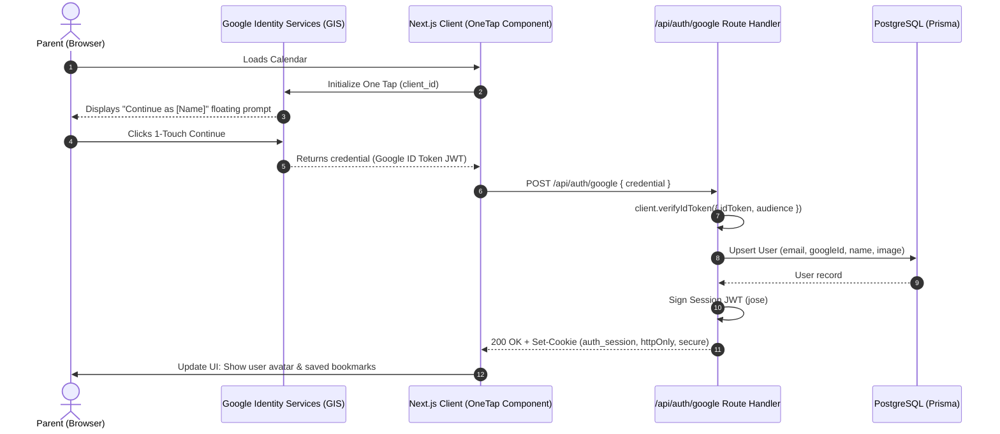

# Research: Auth Architecture & Provider Library for Google One Tap

**Ticket**: `kids-activity-scraper-855.1`  
**GitHub Issue**: [#31 (Feature: User authentication login)](https://github.com/elam03/kids-activity-scraper/issues/31)  
**Date**: October 2026  
**Status**: Decided

---

## 1. Executive Summary & Recommendation

**Recommendation**: **Lightweight Native Google Identity Services (GIS) + `google-auth-library` + `jose` JWT Session Cookie + Prisma `User` Model.**

This approach provides:
1. **Zero Database Overhead for Anonymous Users**: The public calendar remains completely static and lightning-fast; anonymous visitors incur zero auth middleware or database checks.
2. **First-Class 1-Touch Google One Tap Support**: Official Google Identity Services SDK (`https://accounts.google.com/gsi/client`) handles client-side prompt and auto-select; token verification is done server-side using Google's official `google-auth-library`.
3. **Lean Schema Footprint**: Requires only a single `User` model in `prisma/schema.prisma` (unlike NextAuth which mandates `Account`, `Session`, `VerificationToken`, and `User` tables).
4. **Simple Environment & Deployment**: Runs entirely within the existing Next.js App Router and Railway PostgreSQL database without external third-party hosted dependencies (no Clerk MAU limits or Supabase Auth project requirements).

---

## 2. Comparative Evaluation

| Factor | Option A: Native GIS + `google-auth-library` (Recommended) | Option B: NextAuth.js v5 (Auth.js) | Option C: Clerk / Supabase Auth |
| :--- | :--- | :--- | :--- |
| **Google One Tap Native Fit** | **Native** (Google's official GIS SDK) | Complex (requires custom credentials provider or hacky adapter) | Built-in (Clerk), but extra setup for Supabase |
| **Schema Complexity** | **1 Table** (`User`) | **4 Tables** (`User`, `Account`, `Session`, `VerificationToken`) | Hosted external tables or synchronized webhooks |
| **Bundle & Dependency Size** | Minimal (`google-auth-library`, `jose`) | Heavy (`next-auth`, `@auth/prisma-adapter`, edge packages) | Heavy SDKs and client components |
| **Vendor Lock-in & Pricing** | **Zero** (Direct to Google Cloud Console + local DB) | Zero (Open source) | Third-party pricing (Clerk MAU tiers, external accounts) |
| **Next.js 14 App Router Stability** | 100% standard Route Handlers & Server Actions | Auth.js v5 is still iterating on edge/node runtime splits | Works well, but adds external network calls |
| **Public Browsing Impact** | None | Potential middleware latency on all requests | Middleware intercepts every request |

---

## 3. Architecture & Data Flow



---

## 4. Technical Specifications

### 4.1 Server Route Handler (`/api/auth/google/route.ts`)
```typescript
import { OAuth2Client } from 'google-auth-library';
import { NextResponse } from 'next/server';
import { prisma } from '@/lib/prisma';
import { SignJWT } from 'jose';

const client = new OAuth2Client(process.env.GOOGLE_CLIENT_ID);
const JWT_SECRET = new TextEncoder().encode(process.env.AUTH_SECRET || process.env.ADMIN_PASSWORD);

export async function POST(req: Request) {
  const { credential } = await req.json();

  if (!credential) {
    return NextResponse.json({ error: 'Missing credential' }, { status: 400 });
  }

  try {
    const ticket = await client.verifyIdToken({
      idToken: credential,
      audience: process.env.GOOGLE_CLIENT_ID,
    });
    const payload = ticket.getPayload();
    if (!payload || !payload.email) {
      return NextResponse.json({ error: 'Invalid Google payload' }, { status: 401 });
    }

    // Upsert user in database
    const user = await prisma.user.upsert({
      where: { email: payload.email },
      update: {
        name: payload.name || undefined,
        image: payload.picture || undefined,
        googleId: payload.sub,
      },
      create: {
        email: payload.email,
        name: payload.name || 'Parent',
        image: payload.picture,
        googleId: payload.sub,
      },
    });

    // Create session token
    const token = await new SignJWT({
      userId: user.id,
      email: user.email,
      name: user.name,
      image: user.image,
    })
      .setProtectedHeader({ alg: 'HS256' })
      .setIssuedAt()
      .setExpirationTime('30d')
      .sign(JWT_SECRET);

    const response = NextResponse.json({ success: true, user });
    response.cookies.set('auth_session', token, {
      httpOnly: true,
      secure: process.env.NODE_ENV === 'production',
      sameSite: 'lax',
      path: '/',
      maxAge: 30 * 24 * 60 * 60, // 30 days
    });

    return response;
  } catch (error) {
    console.error('Google One Tap verification failed', error);
    return NextResponse.json({ error: 'Authentication failed' }, { status: 401 });
  }
}
```

### 4.2 Required Dependencies
```bash
npm install google-auth-library jose
```

### 4.3 Environment Variables Needed
- `GOOGLE_CLIENT_ID` / `NEXT_PUBLIC_GOOGLE_CLIENT_ID`
- `AUTH_SECRET` (random 32-character secret for signing JWT cookies)

---

## 5. Decision & Next Steps
- **Decision**: Adopt Native GIS + `google-auth-library` + `jose` JWT cookies.
- **Unblocks**:
  - `kids-activity-scraper-855.2`: Schema design (Prisma `User` and `Bookmark` model).
  - `kids-activity-scraper-855.3`: UI prototype for One Tap prompt and user avatar header.
