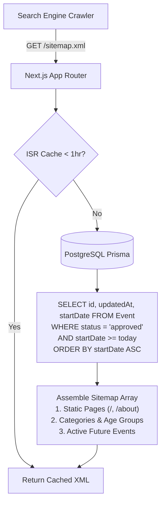

# Research: Dynamic Sitemap & Robots.txt Generation in Next.js App Router

**Ticket**: `kids-activity-scraper-akg.2`  
**GitHub Issue**: [#32 (Improve SEO for discoverability in search/suggestions)](https://github.com/elam03/kids-activity-scraper/issues/32)  
**Date**: October 2026  
**Status**: Decided

---

## 1. Executive Summary & Architecture

Next.js 14 App Router provides native, code-based sitemap and robots generation via [`src/app/sitemap.ts`](file:///Users/ericlam/projects/elam03/kids-activity-scraper/src/app/sitemap.ts) and [`src/app/robots.ts`](file:///Users/ericlam/projects/elam03/kids-activity-scraper/src/app/robots.ts).

Currently, `src/app/sitemap.ts` only serves a static 1-item array for the root URL (`/`).

### Recommendations
1. **Dynamic Event Indexing with Future-Date Filtering**:
   - Query Prisma for all `approved` events where `startDate >= today` (or within the last 7 days).
   - Past events beyond 7 days are excluded from the sitemap to prevent crawl budget waste on expired activities.
   - Use each event's `updatedAt` for the `lastModified` HTTP field.
2. **Category & Segment Filter URLs**:
   - Index high-value search facets (`/?category=festival`, `/?category=arts`, `/?ageGroup=toddlers`).
3. **Robots.txt Protection**:
   - Protect `/admin` and `/api/` from web crawlers.
   - Explicitly define `sitemap: https://www.littledaysout.com/sitemap.xml`.
4. **Caching & Revalidation**:
   - Set `export const revalidate = 3600; // 1 hour` in `src/app/sitemap.ts` so database queries are cached and shared across crawler requests.

---

## 2. Dynamic Sitemap Structure



---

## 3. Implementation Code Blueprint

### `src/app/sitemap.ts`
```typescript
import { MetadataRoute } from 'next';
import { prisma } from '@/lib/prisma';
import { getSiteUrl } from '@/lib/seo-utils';

export const revalidate = 3600; // Cache for 1 hour

const CATEGORIES = ['sports', 'arts', 'nature', 'music', 'education', 'festival'];
const AGE_GROUPS = ['infants', 'toddlers', 'preschoolers', 'kids', 'teens'];

export default async function sitemap(): Promise<MetadataRoute.Sitemap> {
  const baseUrl = getSiteUrl();
  const today = new Date().toISOString().split('T')[0];

  // 1. Root & High Priority Pages
  const staticRoutes: MetadataRoute.Sitemap = [
    {
      url: baseUrl,
      lastModified: new Date(),
      changeFrequency: 'daily',
      priority: 1.0,
    },
  ];

  // 2. Category & Age Group Facets
  const categoryRoutes: MetadataRoute.Sitemap = CATEGORIES.map((cat) => ({
    url: `${baseUrl}/?category=${cat}`,
    lastModified: new Date(),
    changeFrequency: 'daily',
    priority: 0.8,
  }));

  const ageGroupRoutes: MetadataRoute.Sitemap = AGE_GROUPS.map((age) => ({
    url: `${baseUrl}/?ageGroup=${age}`,
    lastModified: new Date(),
    changeFrequency: 'daily',
    priority: 0.8,
  }));

  // 3. Dynamic Active Upcoming Events
  try {
    const activeEvents = await prisma.event.findMany({
      where: {
        status: 'approved',
        startDate: { gte: today },
      },
      select: {
        id: true,
        updatedAt: true,
      },
      orderBy: { startDate: 'asc' },
      take: 1000,
    });

    const eventRoutes: MetadataRoute.Sitemap = activeEvents.map((event) => ({
      url: `${baseUrl}/?event=${event.id}`,
      lastModified: event.updatedAt,
      changeFrequency: 'weekly',
      priority: 0.7,
    }));

    return [...staticRoutes, ...categoryRoutes, ...ageGroupRoutes, ...eventRoutes];
  } catch (error) {
    console.error('Error generating dynamic sitemap', error);
    return staticRoutes;
  }
}
```

### `src/app/robots.ts`
```typescript
import { MetadataRoute } from 'next';
import { getSiteUrl } from '@/lib/seo-utils';

export default function robots(): MetadataRoute.Robots {
  const baseUrl = getSiteUrl();

  return {
    rules: [
      {
        userAgent: '*',
        allow: '/',
        disallow: ['/admin', '/admin/*', '/api/*'],
      },
    ],
    sitemap: `${baseUrl}/sitemap.xml`,
  };
}
```

---

## 4. Crawl Budget & Scalability Analysis
- Total active upcoming events in SF Bay Area: ~150 to 500 events at any given time.
- Sitemap size: ~500 URLs (well below Google's 50,000 URL per sitemap file limit).
- Response time: Cached via Next.js ISR (`revalidate = 3600`), delivering sub-15ms response times to crawlers without database load spikes.
