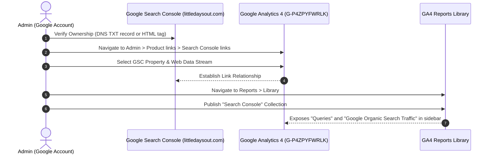

# Guide: GA4 & Google Search Console Property Link Configuration

**Ticket**: `kids-activity-scraper-2sn.3`  
**GitHub Issue**: [#33 (Fix google search and improve google analytics data collection)](https://github.com/elam03/kids-activity-scraper/issues/33)  
**Parent Map**: `kids-activity-scraper-2sn`  
**Date**: October 2026  
**Status**: Decided

---

## 1. Executive Summary & Value Proposition

By default, Google Analytics 4 reports all Google organic search traffic with keywords masked as `(not provided)` to protect searcher privacy.

Linking your verified **Google Search Console (GSC)** property to **Google Analytics 4 (GA4)** unlocks:
1. **Real Organic Search Queries**: Actual keywords parents search (e.g. *"free weekend kids activities san jose"*, *"toddler music classes sf"*).
2. **Impressions, Clicks, and Average Ranking**: Pinpointing high-opportunity event categories where Little Days Out ranks on page 2 (positions 11-20) that can jump to page 1 with SEO optimization.
3. **Unified Reporting**: Viewing organic search keywords alongside on-site engagement (modal opens, ticket clicks, bookmarks).

---

## 2. Configuration Architecture

---

## 3. Step-by-Step Execution Checklist

### Step 1: Ensure Account Permissions
- The Google account executing the link must be:
  - **Verified Owner** of the Search Console property (`littledaysout.com` or `https://www.littledaysout.com`).
  - **Editor** or **Administrator** of the GA4 property (`Little Days Out`).

### Step 2: Establish the Link in GA4 Admin
1. Open [Google Analytics](https://analytics.google.com/).
2. Select your property: `Little Days Out` (`G-P4ZPYFWRLK`).
3. Click **Admin** (gear icon in lower-left corner).
4. In the Property column, scroll down to **Product links** and click **Search Console links**.
5. Click the blue **Link** button.
6. Click **Choose accounts** and select your verified `littledaysout.com` property.
7. Click **Confirm**.
8. Click **Next**, then click **Select** to choose your Web Data Stream (`Little Days Out Web Stream`).
9. Click **Next**, review the configuration, and click **Submit**.
   - *Status will transition to "Linked"*.

### Step 3: Publish Search Console Reports in GA4 Navigation
*(Crucial: GA4 keeps Search Console reports hidden until explicitly published in the Library)*
1. In the GA4 left navigation, click **Reports**.
2. Click **Library** (located at the bottom of the navigation drawer).
3. Under the **Collections** section, locate the **Search Console** card.
4. Click the three dots `⋮` on the Search Console card.
5. Click **Publish**.
6. The left navigation will immediately update with a new **Search Console** drop-down menu containing:
   - **Queries**: Keyword queries, clicks, impressions, CTR, and average position.
   - **Google Organic Search Traffic**: Organic landing pages and engagement metrics.

---

## 4. Verification
- Within 24-48 hours of linking and publishing, search impressions and queries will populate directly inside the GA4 Queries report.
