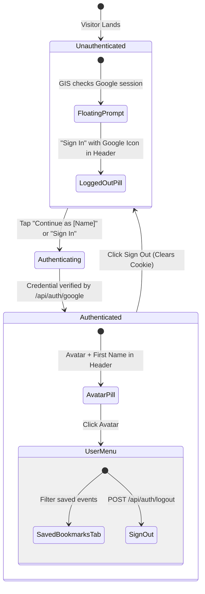

# Prototype: Google One Tap UI & Header Login UX

**Ticket**: `kids-activity-scraper-855.3`  
**GitHub Issue**: [#31 (Feature: User authentication login)](https://github.com/elam03/kids-activity-scraper/issues/31)  
**Parent Map**: `kids-activity-scraper-855`  
**Date**: October 2026  
**Status**: Decided

---

## 1. Executive Summary & User Experience

The authentication UX is designed with the **Three Pillars of User Delight**:
- **Visceral**: Clean, premium Google sign-in pill matching the active theme (Cosmo, Bubblegum, etc.), with high-res avatar rendering and smooth micro-transitions.
- **Behavioral**: Zero friction. One-touch login prompt appears seamlessly via Google Identity Services without full-page redirects or modal disruptions. Unauthenticated browsing is 100% unblocked.
- **Reflective**: Parents feel reassurance that their saved weekend events and bookmarks are preserved and synchronized across all their family devices.

---

## 2. Header State UI Progression



---

## 3. UI Component Blueprint

### 3.1 Desktop Header Layout
```
[ 🎈 Little Days Out ]                        [ ❤️ Tip ] [ ⚡ Lean View ] [ 👤 Sign In / Avatar ] [ Admin ]
```

### 3.2 Logged-out State Pill
```tsx
<button
  onClick={handleSignInClick}
  className="inline-flex items-center gap-2 px-3 py-1.5 sm:px-3.5 sm:py-2 rounded-xl text-xs font-semibold border transition shadow-sm bg-white/10 hover:bg-white/20 border-slate-700 text-slate-100"
  title="Sign in with Google"
>
  <svg className="w-3.5 h-3.5" viewBox="0 0 24 24">
    <path fill="#4285F4" d="M22.56 12.25c0-.78-.07-1.53-.2-2.25H12v4.26h5.92c-.26 1.37-1.04 2.53-2.21 3.31v2.77h3.57c2.08-1.92 3.28-4.74 3.28-8.09z" />
    <path fill="#34A853" d="M12 23c2.97 0 5.46-.98 7.28-2.66l-3.57-2.77c-.98.66-2.23 1.06-3.71 1.06-2.86 0-5.29-1.93-6.16-4.53H2.18v2.84C3.99 20.53 7.7 23 12 23z" />
    <path fill="#FBBC05" d="M5.84 14.09c-.22-.66-.35-1.36-.35-2.09s.13-1.43.35-2.09V7.06H2.18C1.43 8.55 1 10.22 1 12s.43 3.45 1.18 4.94l2.85-2.22.81-.63z" />
    <path fill="#EA4335" d="M12 5.38c1.62 0 3.06.56 4.21 1.64l3.15-3.15C17.45 2.09 14.97 1 12 1 7.7 1 3.99 3.47 2.18 7.06l3.66 2.84c.87-2.6 3.3-4.52 6.16-4.52z" />
  </svg>
  <span className="hidden sm:inline">Sign In</span>
</button>
```

### 3.3 Logged-in Avatar Pill & Popover Menu
```tsx
<div className="relative">
  <button
    onClick={() => setIsMenuOpen(!isMenuOpen)}
    className="inline-flex items-center gap-2 p-1 sm:px-2.5 sm:py-1.5 rounded-full sm:rounded-xl border transition shadow-sm hover:ring-2 hover:ring-violet-500/30"
  >
    {user.image ? (
      
    ) : (
      <div className="w-6 h-6 rounded-full bg-violet-600 text-white font-bold flex items-center justify-center text-xs">
        {user.name?.[0] || 'P'}
      </div>
    )}
    <span className="hidden sm:inline text-xs font-semibold">{user.name?.split(' ')[0]}</span>
  </button>

  {isMenuOpen && (
    <div className="absolute right-0 mt-2 w-56 rounded-2xl bg-slate-900 border border-slate-800 shadow-xl p-2 z-50">
      <div className="px-3 py-2 border-b border-slate-800">
        <p className="text-xs font-bold text-slate-100">{user.name}</p>
        <p className="text-[11px] text-slate-400 truncate">{user.email}</p>
      </div>
      <button
        onClick={handleToggleSavedFilter}
        className="w-full text-left px-3 py-2 mt-1 rounded-xl text-xs font-medium hover:bg-slate-800 text-slate-200 flex items-center gap-2"
      >
        <span>⭐</span>
        <span>My Saved Events ({bookmarkCount})</span>
      </button>
      <button
        onClick={handleSignOut}
        className="w-full text-left px-3 py-2 rounded-xl text-xs font-medium hover:bg-red-500/10 text-red-400 flex items-center gap-2"
      >
        <span>🚪</span>
        <span>Sign Out</span>
      </button>
    </div>
  )}
</div>
```

---

## 4. Google One Tap Trigger Rules
1. **Auto-Prompt on First Visit**: Prompt initializes on load via Google Identity Services (`data-auto_prompt="true"`).
2. **Cooldown Compliance**: If the parent closes/dismisses the floating One Tap prompt, Google Identity Services enforces exponential cooldown before prompting again.
3. **Manual Trigger**: Clicking the "Sign In" button in the header bypasses cooldown by invoking `google.accounts.id.prompt()`.
