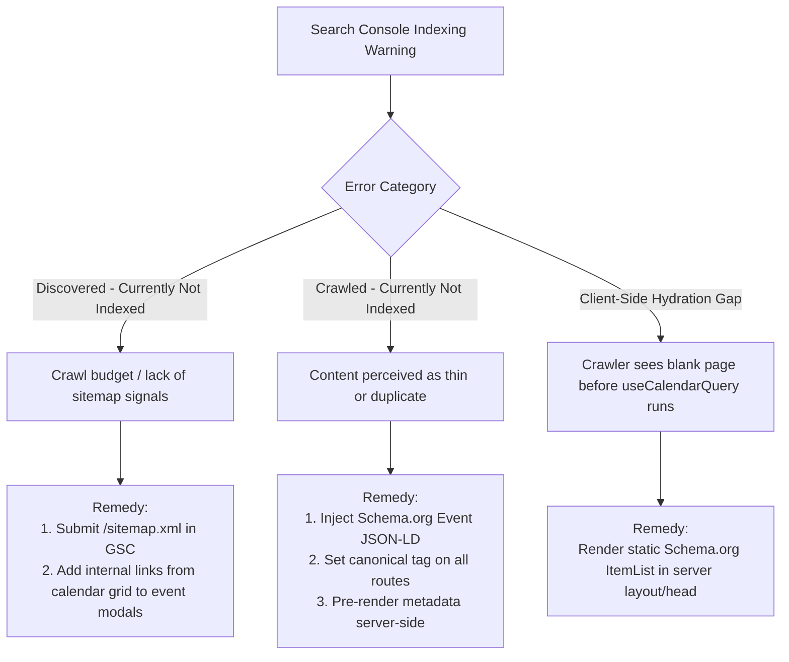

# Research: Google Search Console Domain Verification & Indexing Diagnostics

**Ticket**: `kids-activity-scraper-2sn.1`  
**GitHub Issue**: [#33 (Fix google search and improve google analytics data collection)](https://github.com/elam03/kids-activity-scraper/issues/33)  
**Date**: October 2026  
**Status**: Decided

---

## 1. Executive Summary & Verification Comparison

To diagnose and resolve Google Search appearance and indexing issues for `littledaysout.com`, we evaluated the available verification methods and indexing remedies.

### Verification Method Evaluation

| Method | Property Type | Coverage | Implementation | Pros / Cons |
| :--- | :--- | :--- | :--- | :--- |
| **DNS TXT Record** (Recommended) | **Domain Property** | All subdomains (`www`, apex, staging) & protocols (`http`/`https`) | Add TXT record in DNS provider (Cloudflare / Namecheap / Route 53) | **Best coverage**; immune to application code changes or rebuilds. |
| **HTML Meta Tag** (Recommended Fallback) | **URL-Prefix Property** | Single origin (e.g. `https://www.littledaysout.com`) | Next.js `metadata.verification.google` in `src/app/layout.tsx` | Can be set via environment variable without DNS access; requires code deploy. |
| **HTML File Upload** | URL-Prefix Property | Single origin | Place `google<token>.html` in Next.js `public/` directory | Fragile during repository refactors; not recommended. |

**Strategy**:
1. Implement **both**:
   - Provide the DNS TXT record snippet for registrar-level Domain Property verification.
   - Add `verification: { google: process.env.NEXT_PUBLIC_GOOGLE_SITE_VERIFICATION }` to `src/app/layout.tsx` so URL-prefix verification succeeds automatically once the environment variable is populated.

---

## 2. Common Google Search Indexing Errors & Remedies



---

## 3. Step-by-Step Resolution Guide

### Step 1: Add Next.js Meta Verification to `src/app/layout.tsx`
Support zero-downtime HTML meta verification via environment variable:
```typescript
// In src/app/layout.tsx
export const metadata: Metadata = {
  // ... existing metadata ...
  verification: {
    google: process.env.NEXT_PUBLIC_GOOGLE_SITE_VERIFICATION || undefined,
  },
};
```

### Step 2: Configure DNS TXT Record (Cloudflare / Registrar)
In your domain DNS management:
- **Type**: `TXT`
- **Name**: `@` (or `littledaysout.com`)
- **TTL**: Auto / 300
- **Content**: `google-site-verification=<TOKEN_FROM_SEARCH_CONSOLE>`

### Step 3: Submit Sitemap in Google Search Console
1. In Search Console, select `littledaysout.com`.
2. Go to **Indexing** > **Sitemaps** in the left sidebar.
3. In "Add a new sitemap", type `sitemap.xml`.
4. Click **Submit**. Googlebot will queue and crawl all active event URLs listed in `src/app/sitemap.ts`.

### Step 4: Inspect Key URLs via Search Console URL Inspection Tool
1. Test `https://www.littledaysout.com/` using the search bar at the top of GSC.
2. Click **Test Live URL**.
3. Verify that Googlebot renders the page and detects the `WebSite` and `Event` structured data without errors.
4. Click **Request Indexing** to prioritize immediate crawling.
