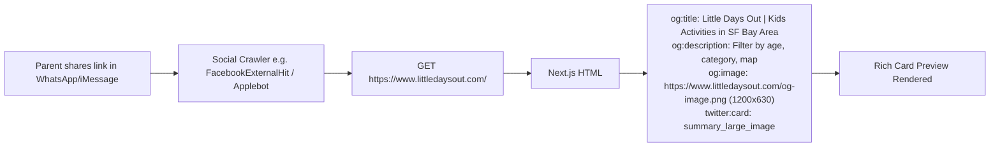

# Prototype: Metadata & OpenGraph Social Sharing Preview Strategy

**Ticket**: `kids-activity-scraper-akg.3`  
**GitHub Issue**: [#32 (Improve SEO for discoverability in search/suggestions)](https://github.com/elam03/kids-activity-scraper/issues/32)  
**Parent Map**: `kids-activity-scraper-akg`  
**Date**: October 2026  
**Status**: Decided

---

## 1. Executive Summary & Problem Diagnosis

When parents share links to `https://www.littledaysout.com` on iMessage, SMS, WhatsApp, Slack, Instagram DMs, or X/Twitter:
- **Current State**: Neither `openGraph.images` nor `twitter.images` is populated in [`src/app/layout.tsx`](file:///Users/ericlam/projects/elam03/kids-activity-scraper/src/app/layout.tsx). The shared message displays a plain text link or empty grey placeholder box.
- **Desired State**: High-impact rich preview card featuring:
  - 1200x630 branded visual banner with app logo, colorful badge, and tagline.
  - Engaging title and value-driven description (*"Discover 100+ curated kids activities, weekend festivals, and free family outings in the SF Bay Area"*).
  - Explicit `image/png` dimensions (1200x630) for instant preview generation across iOS Messages, WhatsApp, and social crawlers.

---

## 2. OpenGraph Architecture & Specifications



### 2.1 Standard Social Image Assets
- **File**: `public/og-image.png` (and/or `src/app/opengraph-image.png`)
- **Dimensions**: `1200 x 630` pixels (standard 1.91:1 ratio)
- **Palette**: Dark cosmic or clean pastel matching site branding, with prominent Little Days Out logo and typography.

---

## 3. Implementation Code Blueprint

### Update `src/app/layout.tsx`:
```typescript
export const metadata: Metadata = {
  metadataBase: new URL(SITE_URL),
  title: {
    default: `${SITE_NAME} | Kids Activities & Family Events in SF Bay Area`,
    template: `%s | ${SITE_NAME}`,
  },
  description: SITE_DESCRIPTION,
  icons: getSiteIcons(),
  manifest: '/manifest.webmanifest',
  keywords: [
    'kids activities bay area',
    'family events sf',
    'things to do with kids san jose',
    'bay area toddler events',
    'weekend family calendar',
    'little days out',
    'bay area kids calendar',
  ],
  authors: [{ name: SITE_NAME, url: SITE_URL }],
  creator: SITE_NAME,
  publisher: SITE_NAME,
  alternates: {
    canonical: '/',
  },
  openGraph: {
    title: `${SITE_NAME} | Kids Activities & Family Events in SF Bay Area`,
    description: SITE_DESCRIPTION,
    url: SITE_URL,
    siteName: SITE_NAME,
    locale: 'en_US',
    type: 'website',
    images: [
      {
        url: `${SITE_URL}/og-image.png`,
        width: 1200,
        height: 630,
        alt: `${SITE_NAME} - Curated Kids Activities & Family Events`,
        type: 'image/png',
      },
    ],
  },
  twitter: {
    card: 'summary_large_image',
    title: `${SITE_NAME} | Kids Activities & Family Events in SF Bay Area`,
    description: SITE_DESCRIPTION,
    images: [`${SITE_URL}/og-image.png`],
  },
  robots: {
    index: true,
    follow: true,
    googleBot: {
      index: true,
      follow: true,
      'max-video-preview': -1,
      'max-image-preview': 'large',
      'max-snippet': -1,
    },
  },
};
```

---

## 4. Verification Tools
- **Facebook Sharing Debugger**: `https://developers.facebook.com/tools/debug/`
- **Twitter Card Validator**: Inspect tweet composer preview
- **LinkedIn Post Inspector**: `https://www.linkedin.com/post-inspector/`
