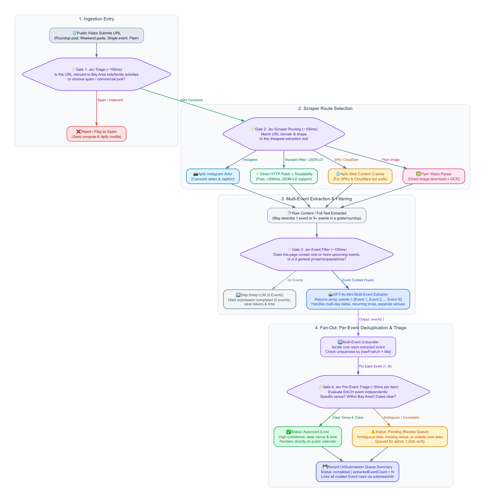

# Multi-Domain Web Scraping & Content Extraction Research

**Issue Reference:** [GitHub #27](https://github.com/elam03/kids-activity-scraper/issues/27)  
**Ticket:** `kids-activity-scraper-p5o.2`  
**Date:** 2026-10-03  
**Status:** Completed  

---

## 1. Executive Summary & Recommended Strategy

Currently, the scraping pipeline exclusively handles Instagram creator feeds using Apify's `apify/instagram-scraper` actor. To support arbitrary URL submissions from visitors (e.g., Eventbrite, city recreation pages, library calendars, Facebook events, neighborhood blogs, and school flyers), the system requires a multi-tier extraction pipeline.

### Recommended 3-Tier Cascading Pipeline with Jev Decision Gates



*Source file:* [`jev-multi-event-pipeline.dot`](jev-multi-event-pipeline.dot) (Render via: `dot -Tpng -Gdpi=180 jev-multi-event-pipeline.dot -o jev-multi-event-pipeline.png`)

1. **Tier 1 (Fast-Path, Free, < 1s):** Direct Node.js `fetch` with browser headers. Check for embedded `application/ld+json` (`Schema.org/Event`) or OpenGraph metadata. Major ticketing and calendar platforms (Eventbrite, Patch, Ticketmaster, civic portals) embed high-fidelity structured event schemas. If found, extract directly with 100% precision and zero AI cost.
2. **Tier 2 (Standard LLM Path, ~1–2s, < $0.001):** Convert the cleaned HTML/article text to Markdown using standard DOM readability algorithms and pass it into the existing `OpenAILLMExtractor` (`gpt-4o-mini`).
3. **Tier 3 (Headless Browser Fallback, ~5–12s, ~$0.003):** If Tier 1 encounters HTTP 403, Cloudflare bot-challenges, or an empty Single-Page Application (SPA) shell, delegate to Apify's `apify/website-content-crawler` in single-page mode (`maxCrawlPages: 1`).

---

## 2. URL Classification & Dispatch Matrix

| URL Domain / Shape | Primary Tool | Fallback Tool | Expected Extraction Fidelity |
|---|---|---|---|
| `instagram.com/p/*`, `instagram.com/reel/*` | Apify `instagram-scraper` (direct URL) | None | High (Text + Carousel slides) |
| `eventbrite.com/e/*` | Tier 1 (Direct Fetch + JSON-LD) | Tier 2 (LLM text) | High (Title, Date, Time, Venue, Cost native in JSON-LD) |
| Municipal / Library (`*.gov`, `*.org`, `*.edu`) | Tier 1 (Direct Fetch) | Tier 2 (LLM text) | High (Clean HTML, no bot-walls) |
| Facebook Events (`facebook.com/events/*`) | Tier 3 (Apify Web Scraper / Crawler) | Manual Flyer Upload | Medium (Heavy login walls require proxy) |
| General blogs / news (`*.com`) | Tier 1 Direct Fetch + Readability | Tier 3 Apify Crawler | High (Article text parsed by GPT-4o mini) |
| Direct Image link (`*.jpg`, `*.png`, `*.webp`) | Direct Image Download | GPT-4o Vision | High (Reuses `parse-image` pipeline) |

---

## 3. Tier 1: Native Fast-Path (JSON-LD & Meta Extraction)

Many modern event sites render Schema.org Event metadata in `<script type="application/ld+json">`.

### Example Extracted JSON-LD
```json
{
  "@context": "https://schema.org",
  "@type": "Event",
  "name": "Toddler Storytime & Crafts",
  "startDate": "2026-10-15T10:30:00-07:00",
  "endDate": "2026-10-15T11:30:00-07:00",
  "location": {
    "@type": "Place",
    "name": "Palo Alto Children's Library",
    "address": "1276 Harriet St, Palo Alto, CA"
  },
  "offers": {
    "@type": "Offer",
    "price": "0",
    "priceCurrency": "USD"
  }
}
```

### Advantages of Tier 1
* **Speed:** 200–500ms network round-trip.
* **Cost:** $0.00 (no third-party compute units or LLM tokens).
* **Accuracy:** 100% deterministic parsing directly from publisher's structured schema.

---

## 4. Tier 2: Clean Text & LLM Extraction

When no JSON-LD schema is present, the raw HTML is parsed into clean prose:

1. Strip script tags, style sheets, tracking pixels, SVG paths, and navigation headers.
2. Extract title, OpenGraph tags (`og:title`, `og:description`), and main article content.
3. Truncate text to 8,000 characters (covering 99% of single-event pages while preserving low token counts).
4. Send to `OpenAILLMExtractor` using the existing tested schema (`src/lib/llm-extractor.ts`).

### Cost Calculation (GPT-4o Mini)
* Input tokens: ~2,000 tokens ($0.15 / 1M tokens) = **$0.00030**
* Output tokens: ~300 tokens ($0.60 / 1M tokens) = **$0.00018**
* **Total cost per page:** **~$0.0005** (half of one cent for 10 pages).

---

## 5. Tier 3: Apify `website-content-crawler` Fallback

When sites block direct node `fetch` (e.g. Cloudflare Turnstile, Akamai) or render purely via client-side JavaScript hydration:

### Actor Details
* **Actor ID:** `apify/website-content-crawler`
* **Maintainer:** Apify official
* **Input Schema:**
  ```json
  {
    "startUrls": [{ "url": "https://example-spa-event.com/event/123" }],
    "maxCrawlPages": 1,
    "crawlerType": "playwright:adaptive",
    "removeCookieWarnings": true,
    "saveMarkdown": true
  }
  ```
* **Output:** Clean Markdown string representing rendered DOM.
* **Execution Time:** 5–10 seconds.
* **Cost:** ~$0.002–$0.004 per page against Apify monthly credits ($5/month included free tier).

---

## 6. Comparison Matrix: Approaches

| Dimension | Tier 1: Direct Fetch + JSON-LD | Tier 2: Direct Fetch + Readability + LLM | Tier 3: Apify Website Content Crawler | Screenshot + Vision |
|---|---|---|---|---|
| **Latency** | 200–500 ms | 1–2 sec | 6–12 sec | 8–15 sec |
| **Cost / Page** | $0.000 | ~$0.0005 (LLM) | ~$0.003 (Apify) + LLM | ~$0.008 (Browser + Vision) |
| **Railway Impact** | Minimal CPU/RAM | Minimal CPU/RAM | Zero local RAM (Apify cloud) | High local RAM if Puppeteer runs on Railway |
| **Maintenance** | Low (standard RFCs) | Low | Low (Apify handles browser updates) | High (fragile viewports, cookie banners) |
| **Resilience** | High for standard sites | High for text blogs | High for bot-protected pages | Moderate |

> **Conclusion on Vision:** Full-page browser screenshotting + vision should **not** be the primary path for web URLs. It consumes 10–20x more bandwidth and token cost, while text/JSON-LD parsing is faster, cheaper, and yields exact date strings. Vision remains reserved for direct image/flyer uploads.

---

## 7. Security & SSRF Safeguards (Critical for Public URL Submissions)

Because public visitors can submit arbitrary URLs, strict defense-in-depth must prevent Server-Side Request Forgery (SSRF) and resource exhaustion on Railway:

1. **Protocol Restriction:** Only allow `http:` and `https:`. Reject `file:`, `gopher:`, `ftp:`, `javascript:`.
2. **Private Network Blacklist:** Resolve DNS hostname and reject private / loopback IP ranges:
   - `127.0.0.0/8` (localhost)
   - `10.0.0.0/8`
   - `172.16.0.0/12`
   - `192.168.0.0/16`
   - `169.254.0.0/16` (cloud instance metadata e.g. AWS/Railway metadata services)
   - `::1` (IPv6 localhost)
3. **Payload Limits:** Maximum fetch response size capped at **5 MB**; abort if stream exceeds limit.
4. **Timeout:** Strict 8-second fetch timeout using `AbortController`.
5. **Rate Limiting:** Enforce a maximum of 5 URL submissions per IP per 10-minute window using our existing `RateLimiter` utility.

---

## 8. Summary Decision for Ticket `kids-activity-scraper-p5o.2`

* **Adopt the Cascading Pipeline:**
  1. If Instagram URL $\rightarrow$ call existing `scrapeInstagramAccount` / Apify Instagram post scraper.
  2. If Direct Image URL $\rightarrow$ call existing flyer image parser.
  3. Otherwise $\rightarrow$ Direct HTTP fetch with JSON-LD detection $\rightarrow$ fallback to Readability + GPT-4o-mini $\rightarrow$ fallback to Apify `website-content-crawler`.
* **Zero Additional Infrastructure:** Can run directly within the existing Railway Next.js service without needing a dedicated Puppeteer container on Railway.
