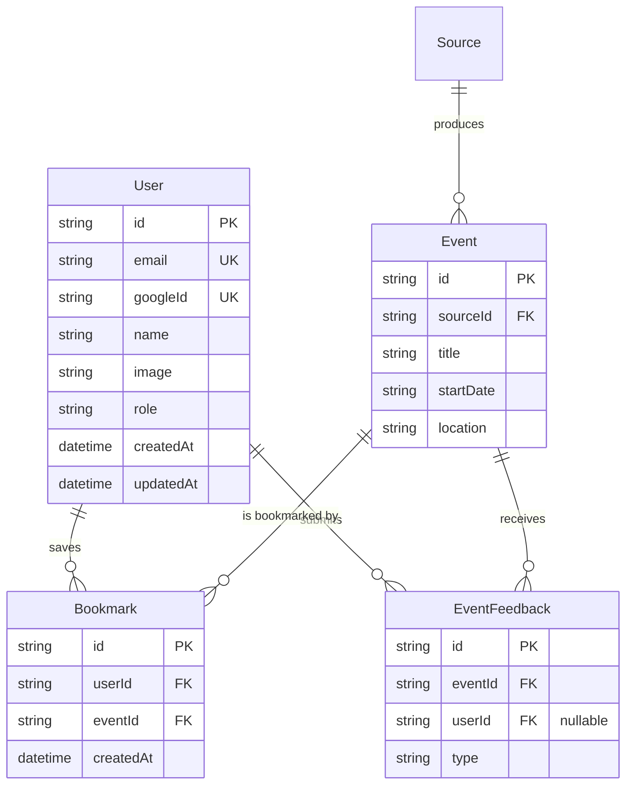

# Decision: Prisma User & Bookmark Schema Design

**Ticket**: `kids-activity-scraper-855.2`  
**GitHub Issue**: [#31 (Feature: User authentication login)](https://github.com/elam03/kids-activity-scraper/issues/31)  
**Parent Map**: `kids-activity-scraper-855`  
**Date**: October 2026  
**Status**: Decided

---

## 1. Executive Summary & Design Rationale

Following the adoption of **Native Google Identity Services + JWT Cookie Session** in `kids-activity-scraper-855.1`, we design the database models strictly around:
1. **User Profile Persistence**: Storing parent identity verified by Google (`googleId`, `email`, `name`, `image`).
2. **Cloud Bookmarks Synchronization**: Enabling parents to save favorite events and access them across mobile and desktop devices.
3. **Zero Impact on Existing Ingestion & Feedback**: No changes to existing required fields in `Source`, `Event`, `UrlSubmission`, or `EventSource`.

---

## 2. Schema Specification



---

## 3. Prisma Schema Code

```prisma
model User {
  id        String          @id @default(uuid())
  email     String          @unique
  googleId  String          @unique
  name      String?
  image     String?
  role      String          @default("parent") // parent | admin
  bookmarks Bookmark[]
  feedbacks EventFeedback[]
  createdAt DateTime        @default(now())
  updatedAt DateTime        @updatedAt

  @@index([email])
  @@index([googleId])
}

model Bookmark {
  id        String   @id @default(uuid())
  userId    String
  user      User     @relation(fields: [userId], references: [id], onDelete: Cascade)
  eventId   String
  event     Event    @relation(fields: [eventId], references: [id], onDelete: Cascade)
  createdAt DateTime @default(now())

  @@unique([userId, eventId])
  @@index([userId])
  @@index([eventId])
}
```

### Additions to Existing Models:
```prisma
// In model Event:
bookmarks       Bookmark[]

// In model EventFeedback (optional user link):
userId          String?
user            User?    @relation(fields: [userId], references: [id], onDelete: SetNull)
@@index([userId])
```

---

## 4. Migration & Compatibility Plan
1. Schema changes are strictly additive — no existing columns are deleted, renamed, or converted to non-null.
2. Production migration command: `npx prisma db push` or `npx prisma migrate deploy`.
3. Unauthenticated parents continue to use `LocalStorage` for temporary favorites; when logging in via Google One Tap, a client sync utility will upsert local bookmarks to the database.
